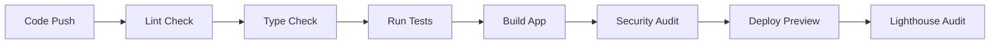
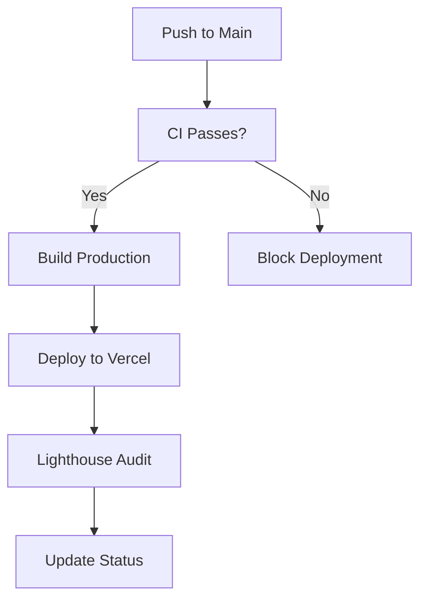

# 🚀 CI/CD Status Dashboard

## 📊 Current Pipeline Status

### ✅ **Implemented Workflows**

| Workflow | Status | Purpose | Trigger |
|----------|--------|---------|---------|
| **CI Pipeline** | ✅ Active | Code quality, tests, build | Push/PR to main/develop |
| **Preview Deployment** | ✅ Active | PR preview environments | Pull requests |
| **Production Deployment** | ✅ Active | Deploy to production | Push to main |
| **Dependency Updates** | ✅ Active | Weekly dependency updates | Schedule + manual |

---

## 🎯 **Quality Gates & Metrics**

### Current Standards
- **Test Coverage**: 70% minimum (Current: ~60%)
- **Linting**: ESLint with Next.js config
- **Type Safety**: TypeScript strict mode
- **Security**: npm audit for vulnerabilities
- **Performance**: Lighthouse CI auditing

### Badges Status
Add these to your README:

```markdown


```

---

## 🔧 **Setup Instructions**

### 1. **Repository Secrets Configuration**

Navigate to `Settings > Secrets and variables > Actions` and add:

#### Required Secrets
```bash
VERCEL_TOKEN=your_vercel_token
NEXTAUTH_SECRET=your_secret_here
GITHUB_TOKEN=ghp_your_github_token
MONGODB_URI=mongodb://your_connection_string
```

#### Optional Secrets
```bash
CODECOV_TOKEN=your_codecov_token_for_coverage
MONGODB_URI_PREVIEW=mongodb://your_preview_db
```

### 2. **Vercel Configuration**

```bash
# Install Vercel CLI
npm install -g vercel

# Login and link project
vercel login
vercel link

# Get project details
vercel env ls
```

### 3. **GitHub Environments**

Create these environments in `Settings > Environments`:
- **production** (protected, requires main branch)
- **preview** (auto-deployment for PRs)

---

## 📈 **Monitoring & Alerts**

### Automated Notifications
- ❌ Build failures → GitHub notifications
- 🚨 Security vulnerabilities → Auto-created issues  
- 📊 Coverage drops → Codecov PR comments
- ⚡ Performance regressions → Lighthouse reports

### Weekly Automation
- 🔄 Dependency update PRs (Mondays 9 AM UTC)
- 🛡️ Security audit reports
- 📊 Performance trending reports

---

## 🎭 **Workflow Visualization**

### CI Pipeline Flow


### Deployment Flow


---

## 🚨 **Common Issues & Solutions**

### Build Failures
```bash
# Check locally first
npm ci
npm run lint
npm run type-check  
npm run test:coverage
npm run build
```

### Environment Variable Issues
```bash
# Verify in Vercel dashboard
vercel env ls

# Test locally with .env.local
cp .env.example .env.local
# Fill in your values
```

### Test Failures in CI
```bash
# Run tests exactly as CI does
npm ci --frozen-lockfile
npm run test:coverage -- --reporter=verbose
```

---

## 📅 **Maintenance Schedule**

### Daily
- ✅ Monitor CI pipeline status
- ✅ Review failed builds
- ✅ Check deployment health

### Weekly  
- 🔄 Review dependency update PRs
- 📊 Analyze coverage reports
- 🚨 Address security alerts

### Monthly
- 🏗️ Update GitHub Actions versions
- 📈 Review performance trends
- 🔧 Optimize workflow performance

---

## 🎯 **Next Steps for Enhancement**

### Short Term (1-2 weeks)
- [ ] Set up Codecov integration
- [ ] Configure deployment notifications
- [ ] Add performance budgets
- [ ] Set up error monitoring (Sentry)

### Medium Term (1 month)
- [ ] E2E testing with Playwright
- [ ] Visual regression testing
- [ ] Automated accessibility testing
- [ ] Multi-environment deployments

### Long Term (3 months)
- [ ] Release automation
- [ ] Canary deployments
- [ ] Feature flag integration
- [ ] Advanced monitoring dashboard

---

## 📞 **Support & Resources**

### Getting Help
- 📖 [GitHub Actions Docs](https://docs.github.com/en/actions)
- 🚀 [Vercel Deployment Guide](https://vercel.com/docs)
- 🧪 [Vitest Documentation](https://vitest.dev/)
- 🔍 [Lighthouse CI Guide](https://github.com/GoogleChrome/lighthouse-ci)

### Team Contacts
- **CI/CD Issues**: Create GitHub issue with `ci/cd` label
- **Deployment Problems**: Check Vercel dashboard first
- **Test Failures**: Review test logs in Actions tab

---

*Last Updated: July 29, 2025*
*Status: ✅ Active and Monitoring*
